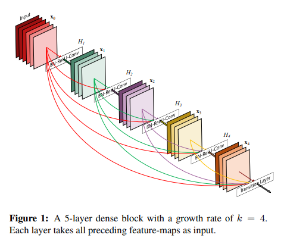
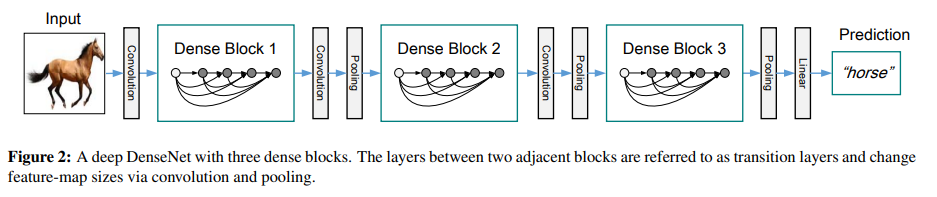

# DenseNet
## ポイント
- DenseBlockを導入。Block内の畳み込み層上位から下位まですべての層にSkipConnetctionを導入
- Block内のSkipConnectionの総数は **L(L+1)/2 個**  
- DenseNet には、利点が4つある。1,勾配消失問題を軽減し、2,特徴の伝播を強化し、3,特徴の再利用を促進し、4,パラメーターの数を大幅に削減します。
## DenseBlock
</img> 
- Block内のすべてのレイヤー (特徴マップサイズが一致する) を相互に直接接続する 
- 各層は先行するすべての層から追加の入力を取得し、独自の特徴マップを後続のすべての層に渡す 
- 各層は3×3Conv, BN, ReLUによって構成される
- したがって、l 層には l 個の入力があり、先行するすべての畳み込みブロックの特徴マップで構成される 。つまり、L 層ネットワークに L(L+1)/2 接続が導入される
- Blockは非常に狭く構成され(たとえば、層ごとに 12 個のフィルタ)、ネットワーク内に「集合知識」を形成 
- 各層は損失関数と元の入力信号からの勾配に直接アクセスでき、暗黙的な深い監視?が可能
- 正則化効果があり、トレーニングセットサイズが小さいタスクでの過剰適合が減少することも観察されている 
</img>
- ダウンサンプリングを容易にするため、ネットワークは複数のDenseブロックに分割して構成される。ブロック間の層を遷移層と呼び、畳み込みとプーリングを行う(バッチ正規化層, 1×1畳み込み層, 2×2平均プーリング)
- DenseBlock内の層数を成長率kと呼ぶ（ハイパーパラメータ）。 各層関数 Hl が k 個の特徴マップを生成すると、l 番目の層は $k0+k×(l−1)$ 個の入力特徴マップを持つことにななる。ここで、k0 は入力層のチャネル数。テストデータセットでは、比較的小さな成長率でstate-of-the-artsを達成(2018年時点)
- 上記結果の考察は、各層がそのブロック内のすべての先行する特徴マップにアクセスでき、ネットワークの「集合的な知識」にアクセスできるため（全層の知識を使って推論できる） 
- 成長率は、各層が「集合知識」にどの程度の新しい情報を付与するかを制御する
- 各3x3畳み込みの前に1x1畳み込みをボトルネック層として導入することが、DenseNetに効果的
- ボトルネック層を持つネットワーク、つまり Hl を BN-ReLU-Conv(1×1)-BN-ReLU-Conv(3×3) として導入したものを　DenseNet-B として定義。論文では、各1×1畳み込みで 4k の特徴マップを生成
- ※ResNets の最近のバリエーション [13] では、多くの層がほとんど貢献しておらず、実際にはトレーニング中にランダムに削除される可能性があるらしい 
## トレーニング方法
- ResNetと比較のため、ResNet論文に使用されているデータオーギュメンテーション手法を使用
- データオーギュメンテーション：ランダムスケール拡張（[256, 480]）, ランダムクロップ（224）, ピクセル毎に平均値減算、Horizontal Flip, Vertical Flip, 色拡張
## テスト推論
- ResNetと比較するために、ResNet論文に使用されている手法を使用
- 10-crop-testing。複数のスケールでスコアを平均する(224, 256, 384, 480, 640)
## 参考
1. https://arxiv.org/pdf/1608.06993.pdf
